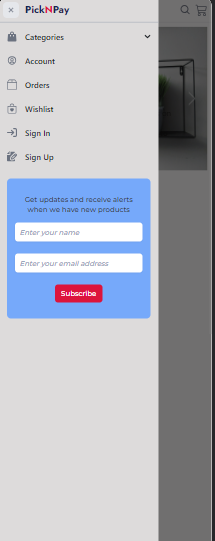

 # [pickNpay](http://3.89.247.229) Ecommerce website and dashboard Documentation
 
   -  Welcome to the documentation for pickNpay an open source e-commerce built using the MERN stack (MongoDB, Express, React, Node.js) with a Vite frontend project. This document will guide you through the key features and functionalities of the application.

   ### Table of Contents
   - 🔗 Introduction
   - 🔗 Tech Stack
   - 🔗 Key Features
   - 🔗 Getting Started
   - 🔗 Installation
   - 🔗 Usage
   - 🔗 Authentication / Authorization
   - 🔗 Deployment
   - 🔗 Contributing
   - 🔗 License

---
##  Introduction

The objective of this e-commerce website project is to create a fully functional and user-friendly online shopping platform using React.js on the front end and Node Js with Express on the backend together with MongoDB as the database. 
The platform allows users to browse through a wide range of products, add items to their shopping cart, and proceed to checkout. The website provides a seamless shopping experience for both buyers and sellers, with a focus on intuitive navigation, smooth interactions, and a visually appealing interface.

- 
- 

---
## Tech Stack

[](https://skillicons.dev)

---
## Key Features

  - [x] Fully **responsive design** to provide optimal user experience on various devices.
  - [x] Implemented **redux** throughout the project to ensure centralized store for data integrity and usage by all component.
  - [x] Implemented **input validation at the front-end**  to enhance data integrity and security.
  - [x] Using **nodemailer**  for User **email verification**.
  - [x] Using **googlespreadsheets**  for User management including creation, updating and deletion.
  - [x] User authentication and authourization via **JWT** implemented using Node.js.
  - [x] User-friendly interface for customers to explore and purchase products.
  - [x] Create, update, and delete categories for products.
  - [x] Product **management**, including creation, updating, and deletion.
  - [x] User **management**, including creation, updating, and deletion.
  - [x] **Cloudinary** integration for **uploading and managing multiple product images**. 
  - [x] Advanced search and filter options for categories, products, and price ranges with pagination.
  - [x] Order history and sales analytics, including revenue overviews.
  - [x] Seamless order creation and the ability to add products to the cart.

---

## 💻 Getting Started <a name="getting-started"></a>

To get a local copy up and running, follow these steps.

### Prerequisites
- Have a computer and internet connection.
- Have a general understanding of testing software.
- Have `visual-studio code` or any other code editor installed on your computer.

---

## ⚙ Installation

👉1: Ensure you have docker and docker-compose installed on your machine(Ubuntu or Windows Subsystem for Linux(WSL)):

👉2: Clone the GitHub repository to your local machine:

```bash
git clone https://github.com/Hardarmyyy/pick-n-pay-app
```

👉3: Install the required dependencies for the frontend:

```bash
cd CLIENT
npm install
```

👉4: Create a .env file in the CLIENT directory and add the following variables:

```bash
cd CLIENT
touch .env
# Paste the following in the .env file
VITE_API_URI==<Your backend-server URL>
```

👉5: Install the required dependencies for the server side:

```bash
cd SERVER
npm install
```

👉6: Create a .env file in the SERVER directory and add the following variables:

```bash
cd SERVER
touch .env
# Paste the following in the .env file
MONGODB_URI=<Your MongoDB atlas Cluster Connection URI> # Register on mongodb atlas to get a MongoDB cluster coonection URI
PORT=<Your desired port number>
SALT=<your salt round number>
EXPIRY_KEY_EMAIL=7d
EXPIRY_KEY_ACCESS=15m
EXPIRY_KEY_REFRESH=1h
EXPIRY_KEY_RESET=1h
SESSION_SECRET=<Your_SESSION_SECRET_here>
VERIFY_EMAIL_TOKEN_SECRET=<Your_VERIFY_EMAIL_TOKEN_SECRET_here>
ACCESS_TOKEN_SECRET=<Your_ACCESS_TOKEN_SECRET_here>
REFRESH_TOKEN_SECRET=<Your_REFRESH_TOKEN_SECRET_here>
RESET_PASSWORD_TOKEN_SECRET=<Your_RESET_PASSWORD_TOKEN_SECRET_here>

SMTP_HOST=smtp.gmail.com
SMTP_PORT=465
SMTP_SERVICE=gmail
SMTP_MAIL=<Your Email_that_you_use_for_sending_emails_via Nodemailer> 
SMTP_PASSWORD=<Your password_that_you_generate_for_your_app_from_your email>

GOOGLESPREADSHEETID=<Your googlespreadsheet ID>

FRONTEND_URL=<Your frontend url>

CLOUDINARY_NAME=<Your Cloudinary Name>
CLOUDINARY_API_KEY=<Your Cloudinary API Key>
CLOUDINARY_API_SECRET=<Your Cloudinary API Secret>

```

👉7: Create a .env file in the root directory for docker-compose and add the following variables:

```bash
touch .env
# Paste the following in the .env file
MONGODB_URI=<Your MongoDB atlas Cluster Connection URI>
PORT=<Your desired port number>
SALT=<your salt round number>
EXPIRY_KEY_EMAIL=7d
EXPIRY_KEY_ACCESS=15m
EXPIRY_KEY_REFRESH=1h
EXPIRY_KEY_RESET=1h
SESSION_SECRET=<Your_SESSION_SECRET_here>
VERIFY_EMAIL_TOKEN_SECRET=<Your_VERIFY_EMAIL_TOKEN_SECRET_here>
ACCESS_TOKEN_SECRET=<Your_ACCESS_TOKEN_SECRET_here>
REFRESH_TOKEN_SECRET=<Your_REFRESH_TOKEN_SECRET_here>
RESET_PASSWORD_TOKEN_SECRET=<Your_RESET_PASSWORD_TOKEN_SECRET_here>

SMTP_HOST=smtp.gmail.com
SMTP_PORT=465
SMTP_SERVICE=gmail
SMTP_MAIL=<Your Email_that_you_use_for_sending_emails_via Nodemailer> 
SMTP_PASSWORD=<Your password_that_you_generate_for_your_app_from_your email>

GOOGLESPREADSHEETID=<Your googlespreadsheet ID>

FRONTEND_URL=<Your frontend url>

CLOUDINARY_NAME=<Your Cloudinary Name>
CLOUDINARY_API_KEY=<Your Cloudinary API Key>
CLOUDINARY_API_SECRET=<Your Cloudinary API Secret>
VITE_API_URI=<your server url>
WEBPORT=<external port for the nginx service> # Ex: 80
USERNAME=<your dockerhub username> # Ex: dockerhub 
```
---

## Usage 

#### Add the current user to docker group to run docker commands

```bash
# Run the cmd below to add the current user to the docker group
sudo usermod -aG docker $USER
```
---

## Authentication / Authorization
pickNpay offers a robust authentication system that enables users to conveniently and securely access their accounts. Additionally, for users who choose to log in using their email addresses, an email containing a verification link will be sent to ensure the authenticity of their account.

The platform employs **role-based access control for authorization**, which involves categorizing permissions into roles such as "buyer" or "seller" or "Admin" and then assigning these roles to respective users. This practice is a widely recognized and effective method for organizing authorization mechanisms.

The **authentication process** is further enhanced with JWT (JSON Web Tokens) Access, Refresh Tokens, Cookies, and Axios integration. In cases where a request, such as a "getCourse" request, results in a 401 error due to unauthorized access, a RefreshToken API is invoked.

Upon receiving a response from the RefreshToken API, the original request is reattempted, thus enabling a seamless continuation of the user's intended action.

Should the Refresh Token expire, a 403 HTTP status code will be ivoked from the server, indicating that the user needs to reauthenticate.

In situations where a 403 error occurs during the RefreshToken API process, the system will clear all cookies, and the window will be reloaded for a complete sign-out effect. This ensures that users are aware of the situation and provided with a smooth logout experience.

---

## Deployment in development

### In the root directory, create a folder named CONFIG and add the below nginx configuration file inside the CONFIG folder

```bash
# Run the cmd below in the root directory
mkdir CONFIG
cd CONFIG
touch picknpay.conf
# copy the below configuration into the picknpay.conf file
server {
    listen       80;
    listen  [::]:80;
    server_name  localhost;

    #access_log  /var/log/nginx/host.access.log  main;

    location / {
        proxy_pass   http://client:5173;
    }

    location /api {
        proxy_pass   http://server:4080;
    }

}

```
### Starting the application in development mode

```bash
# Run the cmd below to start the application in development mode
docker-compose -f docker-compose.dev.yaml up -d --build

```
---

## Deployment for production

### In the root directory, under the CONFIG folder add the below nginx configuration file inside the CONFIG folder on the production server

```bash
# Run the cmd below in the root directory
cd CONFIG
touch nginx.conf

# copy the below configuration inside the nginx.conf file
upstream client {
    server client:5173;
}

upstream server {
    server server:4080;
}

server {
    listen 80;

    location / {
        proxy_pass http://client;
        proxy_http_version 1.1;
        proxy_set_header Upgrade $http_upgrade;
        proxy_set_header Connection "upgrade";
        proxy_set_header X-Forwarded-Host $server_name;

    }

    location /api {
        proxy_pass http://server;
    }
}

server {
    listen  80; 
    server_name proxy.localhost;

    location / {
        proxy_pass http://proxy_manager:81;
    }
}

```

### Building the docker images for production

```bash
# Run the cmd below in the root directory
docker-compose -f docker-compose.prod.yaml --env-file .env.prod build 
```
### Deploying the docker images to dockerhub registery

```bash
# Login to docker registry website to generate your token and copy the token
# Account -> Account settings -> security -> New access token
# Run the cmd below to login your docker credentails
docker login
# Enter your username and use the generated token as password to login
# After login, run the cmd below in the root directory to push the images to dockerhub
docker-compose -f docker-compose.prod.yaml --env-file .env.prod push
```

### Staring the application with docker-compose in detached mode

```bash
# Run the cmd below in the root directory on your production server
docker-compose -f docker-compose.prod.yaml --env-file .env.prod up -d 
```

#### Accessing the application

    NOTE: If your WEBPORT environment variable in the .env file is 80

👉 - Visit http://localhost OR http://<your public ip address> to access the frontend 

👉 - Visit http://localhost/api  OR http://<your public ip address/api> to access the backend

👉 - Visit http://proxy.localhost  OR http://<proxy.your public ip address> to access the npm proxy manager

---

## Author

👤 **Adeyemo Adams** -->

- GitHub: [@Hardarmyyy](https://github.com/Hardarmyyy)
- LinkedIn: [LinkedIn](https://www.linkedin.com/in/adams-adeyemo-0b7a55220)

## Show your support

Give a ⭐️ if you like this project!

---

### Contributing

Contributions are welcome! Please open an issue if you have any questions or suggestions. Your contributions will be acknowledged. Contact me for more information.

---

### License

Licensed under the MIT License. Check the [LICENSE](./LICENSE) file for details.

<h4>If you're interested in showing your support for my efforts, please consider giving a ⭐ star to my repository. Alternatively, you're welcome to get in touch with me, and we can share a coffee together ☕️❤️‍🔥.</h4>
